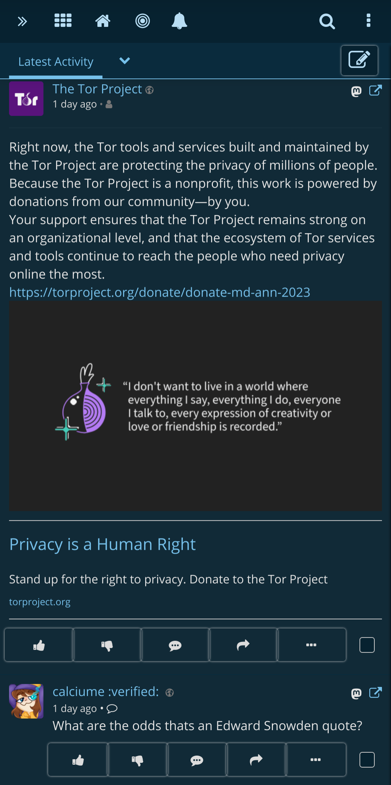
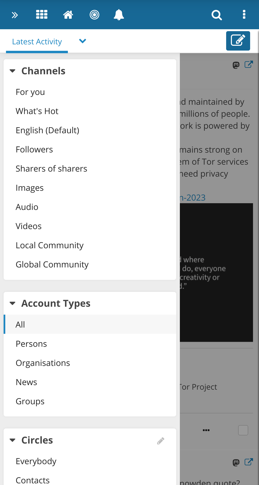

Friendica - your open and free social network
=============================================

Welcome to the free social web. Friendica is a platform for decentralised social communication linking to other independent social and corporate services.

Friendica connects you to a federated communications network of thousands of servers called the Fediverse.
Through various protocols you can interact with anyone on [Friendica]( https://friendi.ca), [Mastodon](https://joinmastodon.org), [Lemmy](https://join-lemmy.org/), [Diaspora](https://diasporafoundation.org), [Misskey](https://join.misskey.page), [Peertube](https://joinpeertube.org/), [Pixelfed](https://pixelfed.org/), [Pleroma](https://pleroma.social) and many more.
Receiving content from Tumblr, WordPress and RSS is also possible.
Friendica allows to import and mirror your content via add-ons such as ITTT and Buffer.
You can control the privacy scope of your content.

Being part of the Fediverse allows you to be free from data-harvesting corporations.
Enjoy open social communication, independent of any specific provider.

[Join Friendica](https://dir.friendica.social/servers) today or set up [your own Friendica instance](doc/Install.md).

### Friendica on desktop

### Friendica on mobile

## Endorsements

- Friendica is listed on  in the [Fediverse category](https://codeberg.org/teaserbot-labs/delightful-humane-design#fediverse).
