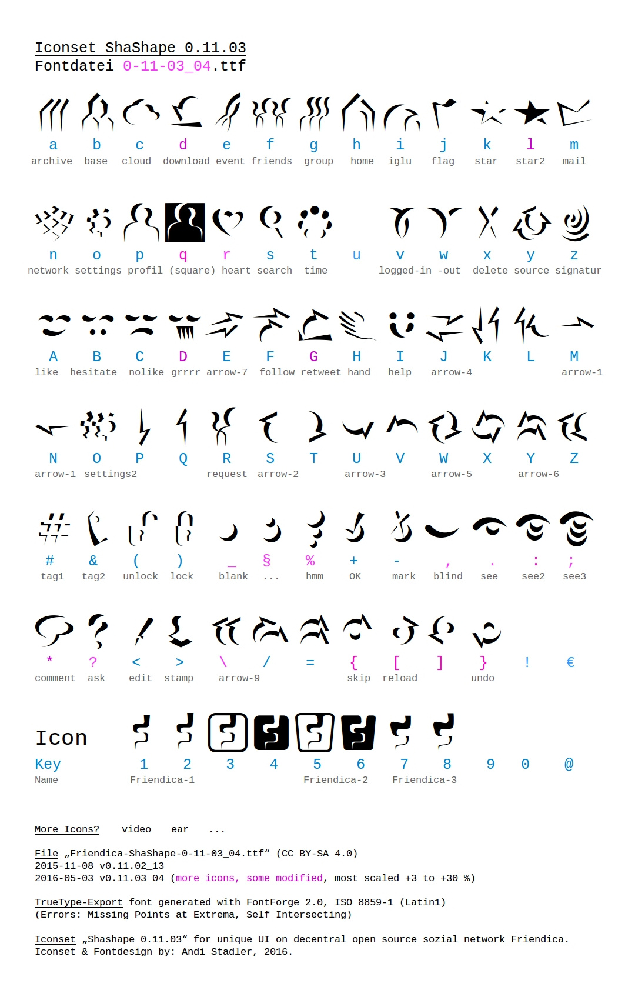

ShaShape Font
=============

Font created by Andi Stadler for the Friendica project.

History
-------

The iconset started from the new default user avatar (letter "p") Andi made for the Hackathon 2014 in Berlin. To accompany that avatar, he developed the other icons.

License
-------

The iconset is published unter the [CC-BY-SA 4.0][cc] license.

Preview
-------

[cc]: https://creativecommons.org/licenses/by-sa/4.0
